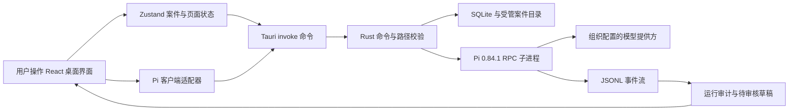

# LegalDesk 全仓代码讲解

这套文档解释 LegalDesk 当前仓库中每一类自有文件，以及每个源代码文件内有意义的连续行号范围。讲解基线是产品改造提交 `a60f366`；本目录只增加解释，不改变该提交中的程序逻辑。

“逐行”在这里采用可维护的工程含义：导入、类型、函数、SQL、状态更新、JSX 区域和 CSS 规则按连续行号逐段解释；空行、单独括号和重复声明与相邻逻辑合并。机器生成的锁文件、图片和图标不把哈希或二进制字节机械翻译成中文，而是逐文件说明来源、用途、引用关系和安全审阅方法。

## 阅读顺序

1. [仓库入口与构建配置](./01-repository-and-config.md)：从安装、构建、CI、许可和产品文档理解项目边界。
2. [React 前端](./02-frontend.md)：理解页面、状态、Tauri IPC、智能体运行界面和样式。
3. [Rust/Tauri 与 Pi 后端](./03-backend-rust.md)：理解 SQLite、受管文件、备份、Pi RPC、进程控制和安全测试。

行号链接以这套文档生成时的工作树为准。源文件改变后，解释内容和行号应在同一个 PR 中更新。

## 程序如何流动

关键边界是：浏览器层不持有模型密钥，也不直接请求模型；Rust 只把用户明确选择、属于当前案件且通过路径/类型/容量校验的文本快照交给 Pi；Pi 以零工具模式运行；输出先成为 `pending` 草稿，不能自动形成正式法律成果。

## 三条主线

### 普通案件数据

`src/App.tsx` 负责页面外壳，页面和组件调用 Zustand action；`src/store/index.ts` 通过 Tauri `invoke` 调用 `src-tauri/src/lib.rs` 暴露的命令；Rust 将案件、材料、文书、证据和模板写入 SQLite，并把附件复制到应用受管目录。

### 智能体运行

`src/agents/registry.json` 定义三个固定智能体；`src/ai/piClient.ts` 是前端唯一 Pi IPC 入口；`AgentPanel` 和 `AgentCenter` 发起运行并监听事件；`src-tauri/src/pi.rs` 校验智能体、案件和材料，启动固定版本 Pi RPC，限制输入输出并持久化运行、事件和待审核产物。

### 安全与发布

根 `package.json` 不允许安装生命周期脚本，CI 会在安装前再次拒绝这些键并使用 `npm ci --ignore-scripts`。Tauri capability 只开放窗口基础能力、选择文件和打开受管路径。生产窗口关闭 devtools，CSP 只允许应用自身脚本。路径删除和备份导入必须经过 UUID、案件归属、canonical path 与受管根目录检查。

## 覆盖边界

三册合计覆盖：

- 根目录与 `.github` 中所有被 Git 跟踪的构建、配置、安全、许可和说明文件；
- `src` 下全部 TypeScript、TSX、CSS、JSON、类型声明与静态资源；
- `src-tauri` 下全部自有 Rust、Cargo/Tauri 配置、capability、忽略规则与应用图标；
- `package-lock.json` 与 `Cargo.lock` 的生成和供应链审阅规则；
- 当前产品文档与被归档的旧 SaaS 方向。

不包含 `node_modules/`、`dist/`、`src-tauri/target/`、Tauri 自动生成 schema、本机 Pi 会话或用户案件目录，因为它们不是仓库中的自有源代码，且均被忽略或属于构建/运行产物。

## 当前能力结论

- 安全问题的仓库级修复已经完成：危险根 `postinstall` 已移除，依赖安装禁用脚本，CI 增加守门；路径穿越、任意附件删除和不可信备份路径已增加校验与回归测试。
- 桌面端具备大模型接入链路，但依赖本机显式安装精确版本 Pi，并由用户或机构完成模型提供方认证。Pi 未就绪时，案件和卷宗功能可用，智能体运行会被拒绝。
- “本地优先”指案件和受管文件默认留在本机，不代表模型推理天然离线。选择云端模型时，被授权的文本快照仍会发送给相应提供方。
- 当前只接受 UTF-8 文本材料；PDF、Office、图片和扫描件需要后续受控提取管线，不能把原始二进制直接交给模型。

## 修改代码时如何维护本手册

1. 先确定修改属于配置、前端还是后端册。
2. 同步更新对应文件的行号范围和行为说明。
3. 如果新增文件，把它加入本页覆盖边界及对应分册。
4. 运行前端构建、Rust 格式/检查/测试、依赖审计和文档链接检查。
5. PR 中同时说明代码行为变化、安全影响和讲解文档变化。
